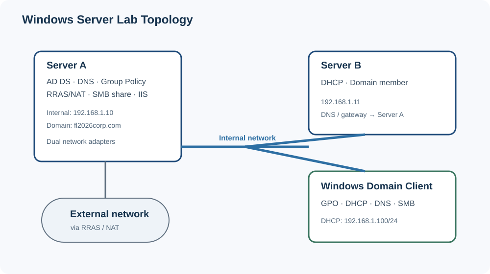
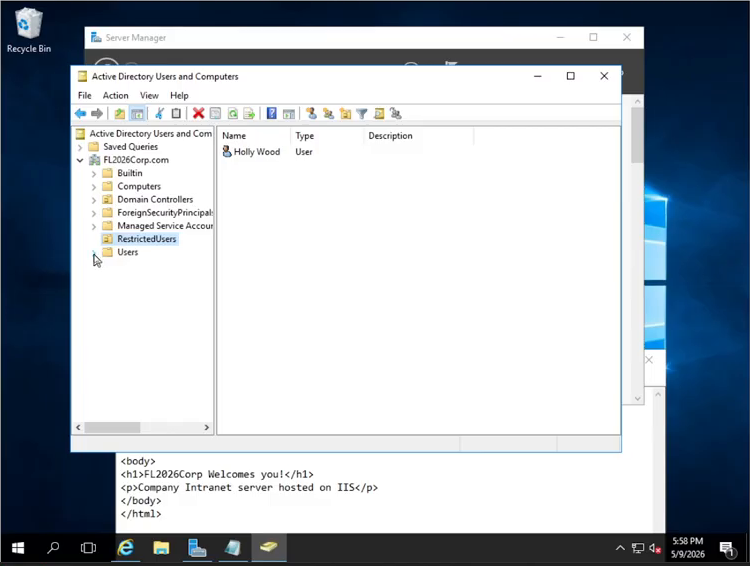
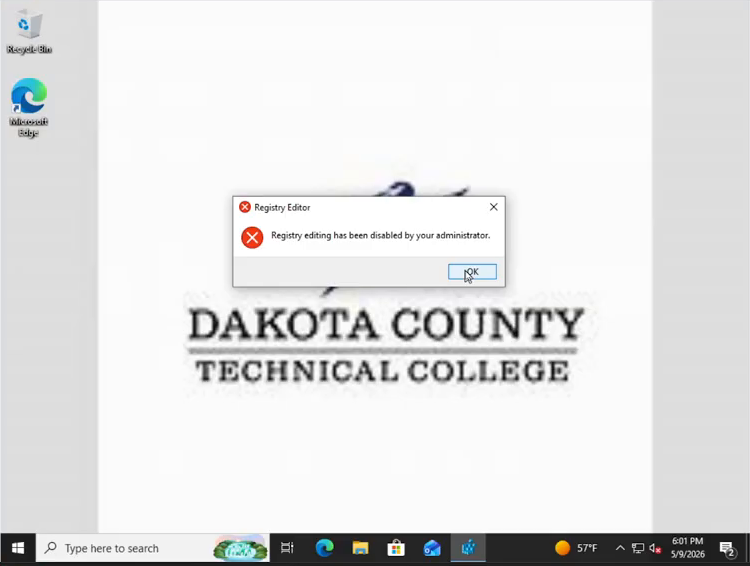
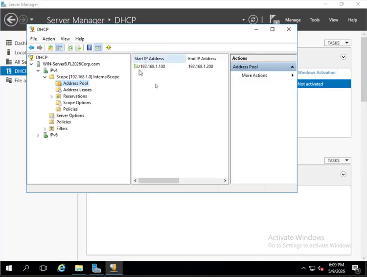
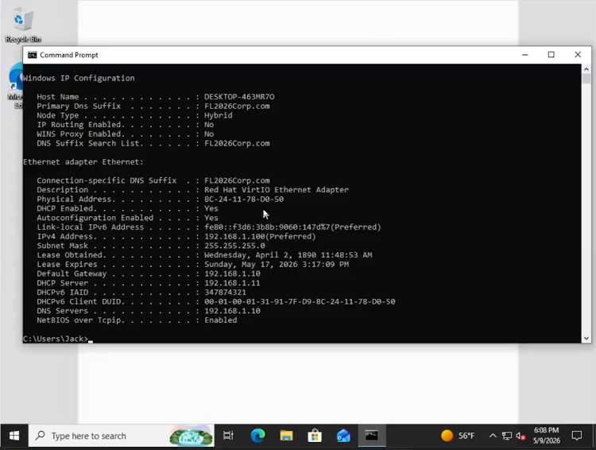
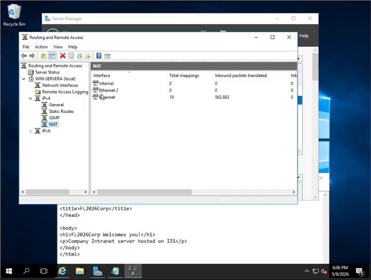
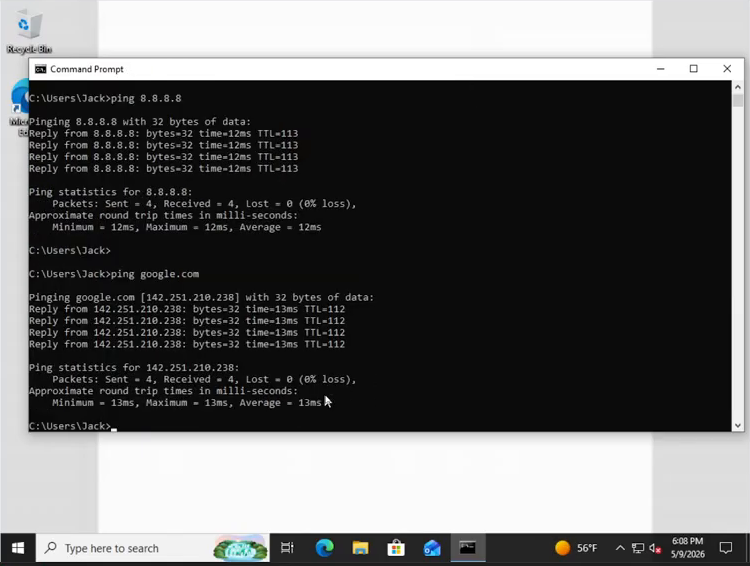

# Windows Server Infrastructure Lab

I built a Windows domain with two servers and one workstation. Server A ran AD DS, DNS, Group Policy, RRAS/NAT, a shared folder, and IIS. Server B handled DHCP. I used the workstation to check domain logons, user restrictions, addressing, name resolution, and access to the shared drive.

Screenshots are from my original course lab recording. The [evidence map](docs/evidence-map.md) links them to the relevant timestamps.

## Environment at a glance

| System | Demonstrated role |
| --- | --- |
| Server A | Active Directory Domain Services, DNS, Group Policy, RRAS/NAT, file share, IIS |
| Server B | Domain member and DHCP server |
| Windows client | Domain-joined endpoint used to validate policy, addressing, DNS, routing, and mapped-drive behavior |

The internal domain was `fl2026corp.com`. Server A used `192.168.1.10` on the internal network; Server B used `192.168.1.11`. The client received `192.168.1.100/24` from Server B.

## What I configured

- Installed AD DS and promoted Server A as the domain controller for a new forest.
- Created domain users and a `RestrictedUsers` organizational unit.
- Linked targeted restrictions to the OU while keeping separate domain-wide policies for wallpaper and drive mapping.
- Configured DNS for the domain and reviewed registered host records.
- Configured DHCP on Server B with a `192.168.1.100–192.168.1.200` pool and scope options for gateway, DNS, and domain name.
- Configured Routing and Remote Access with NAT on a dual-NIC server so the internal network could reach external networks.
- Shared a central folder and mapped it automatically at user logon through Group Policy.
- Hosted a small HTML page with IIS and accessed it from another server.

## Validation highlights

The walkthrough included these client checks and server-side results:

- A restricted domain user received the configured wallpaper, mapped drive, and policy restrictions. Registry Editor displayed an administrator restriction message.
- A second domain user could open tools that were restricted for the OU-scoped account, confirming the restrictions followed the user’s policy scope.
- `ipconfig /all` showed the client lease, DHCP server, DNS server, and default gateway supplied by the lab.
- Pings to `8.8.8.8` and `google.com` returned replies; the hostname resolved before the second ping.
- DHCP Manager showed the configured scope, options, and an issued lease.
- The IIS page hosted on Server A loaded from Server B. The page did not load reliably during the workstation test.

Representative evidence:

| Configuration | Applied behavior |
| --- | --- |
|  |  |
|  |  |
|  |  |

## Repository guide

- [Architecture](docs/architecture.md) — components, addressing, and network relationships
- [Implementation](docs/implementation.md) — server roles and applied settings
- [Validation](docs/validation.md) — what was tested, where, and what the evidence supports
- [Evidence map](docs/evidence-map.md) — recording timestamps and linked screenshots
