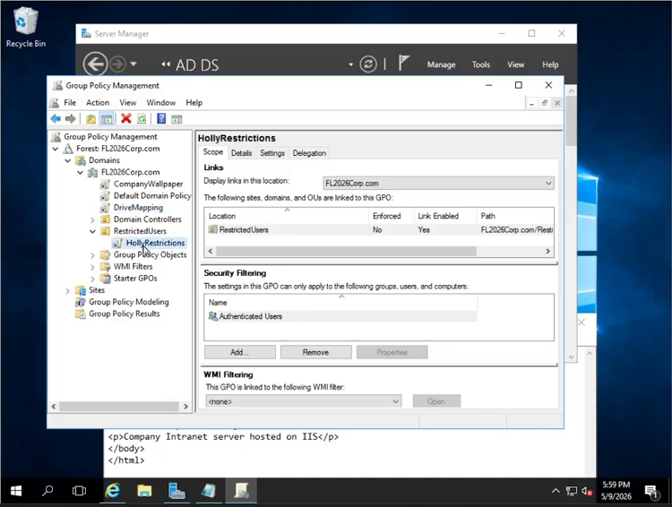
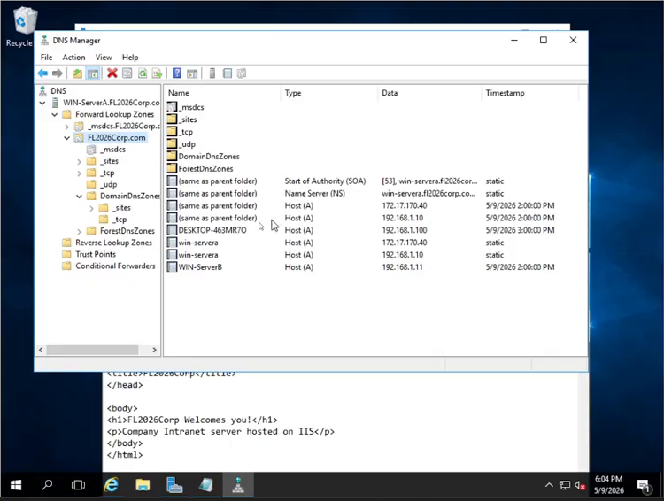
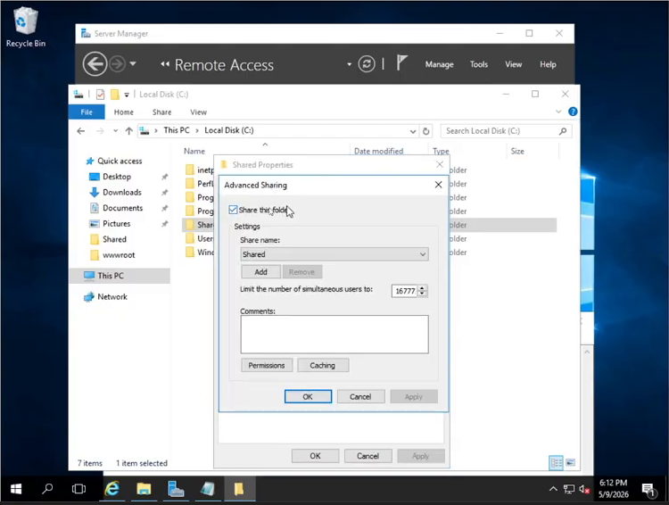
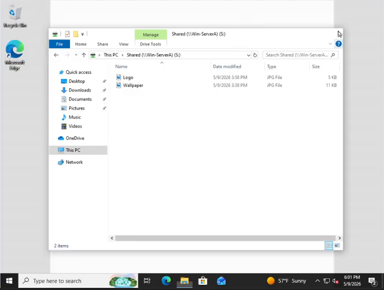
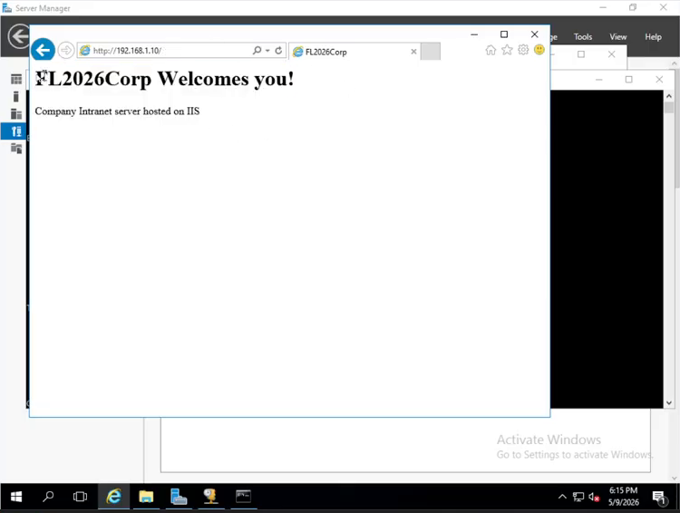

# Implementation

## Identity and policy

I assigned Server A a static internal address before configuring AD DS and DNS. I then promoted it to a domain controller for the new `fl2026corp.com` forest. In Active Directory Users and Computers, I created domain users and a `RestrictedUsers` OU.

I configured separate scopes in Group Policy Management:

- An OU-linked policy applied user restrictions to the restricted account.
- Domain-linked policies applied the lab wallpaper and mapped a shared drive at logon.
- I used a second user outside the restricted OU as a comparison account.

On the client, I confirmed the resulting wallpaper, mapped drive, and blocked administrative tools. The comparison account could open tools that were blocked for the restricted user.

## Core network services

I used DNS Manager to review the domain forward lookup zone and host records for the lab systems. The client later resolved an external hostname during command-line validation.

I hosted DHCP separately on Server B. In DHCP Manager, I reviewed the active IPv4 scope, address pool, issued lease, and scope options. The options identified Server A as the internal gateway and DNS server and included the domain name.

## Routing and services

I used a dual-NIC design for Server A and configured Routing and Remote Access with NAT to connect the internal lab network to the external side. In the RRAS console, I reviewed the NAT interfaces and traffic counters.

I shared the `Shared` folder on Server A using Advanced Sharing. A domain-wide GPO mapped it as drive `S:` at logon, and the client could open the folder and see its files.

I hosted a small custom HTML page with IIS on Server A. I loaded the page from Server B by addressing the Server A site directly.

